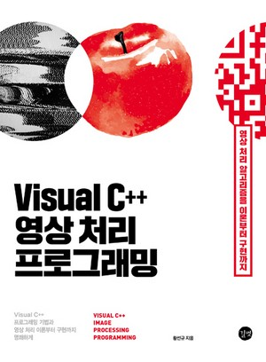
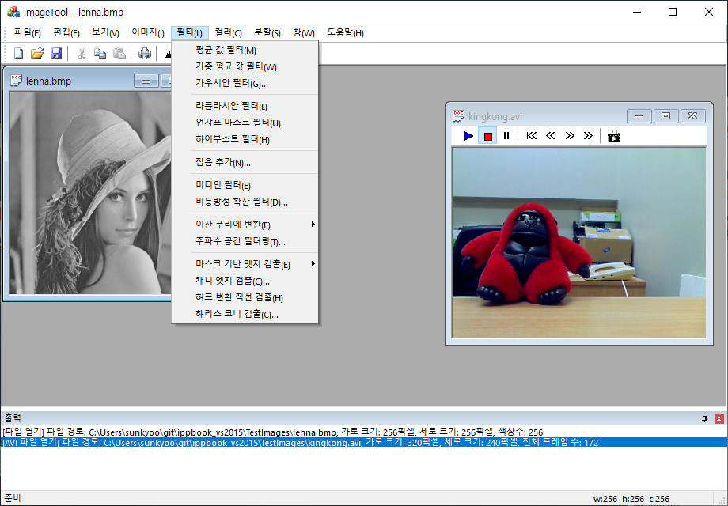
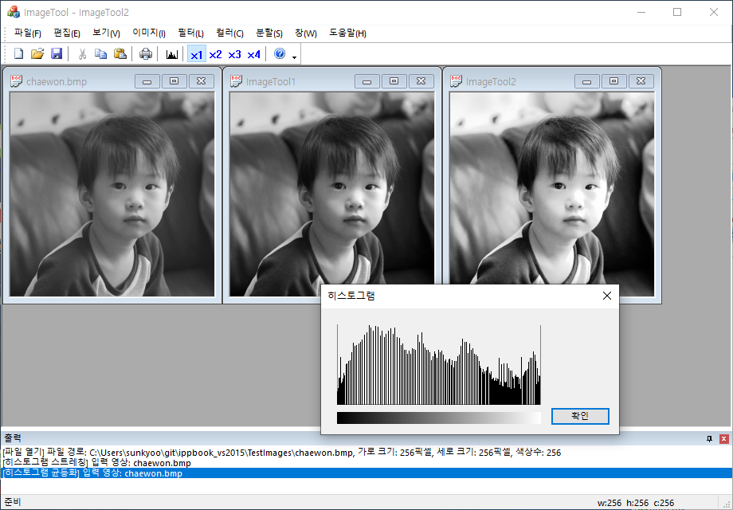
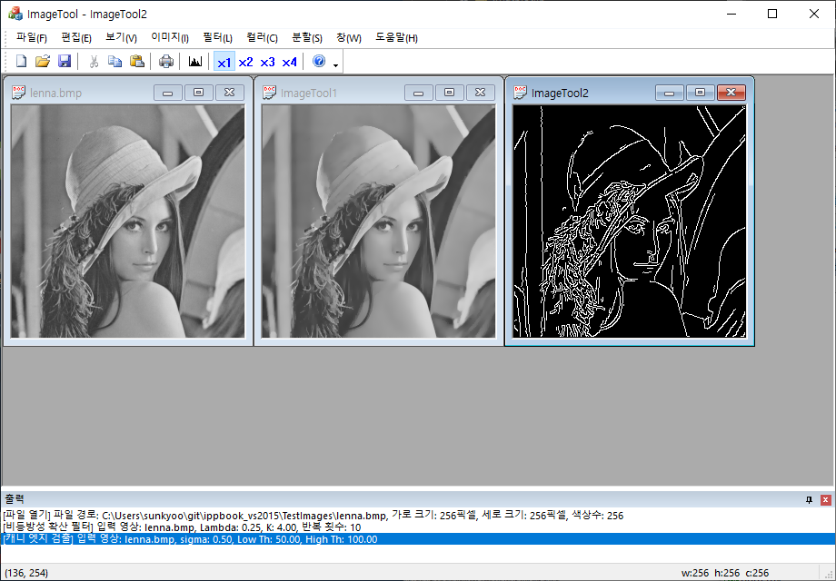
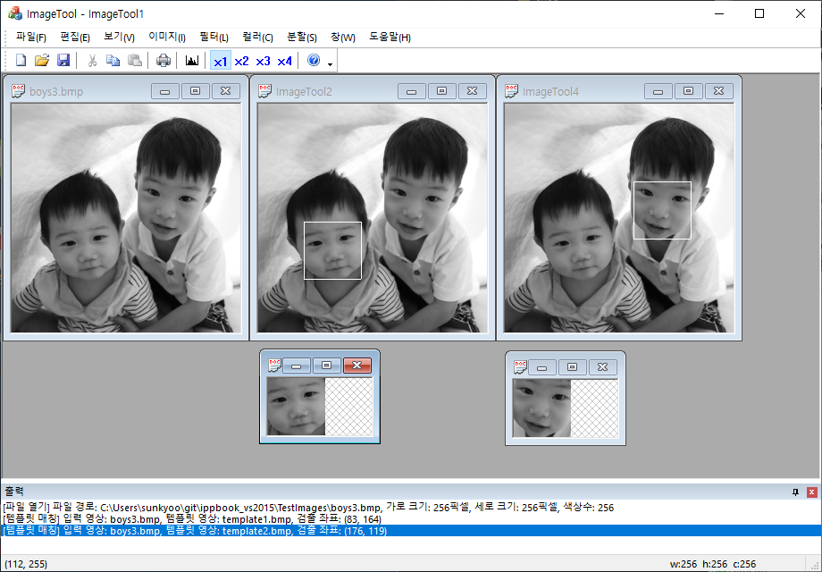

# 개요

"Visual C++ 영상 처리 프로그래밍" (길벗, 2015) 책에서 설명하는 ImageTool 프로그램 소스 코드입니다. 

전체 예제 파일은 아래 링크에서 다운로드 받을 수 있습니다.

https://www.gilbut.co.kr/book/view?bookcode=BN001382

# 사용 방법

Visual Studio 2015에서 ./ImageTool/ImageTool.sln 파일을 불러와서 빌드하면 ImageTool.exe 파일이 생성됩니다.

# 스크린샷
### 정지 영상과 동영상 불러오기

### 히스토그램 처리 (스트레칭, 균등화/평활화)

### 필터링 (비등방성 확산, 캐니 엣지 검출)

### 템플릿 매칭

